## Video

<iframe width="560" height="315" src="https://www.youtube.com/embed/TawD7v3okHQ" frameborder="0" allow="accelerometer; autoplay; encrypted-media; gyroscope; picture-in-picture" allowfullscreen></iframe>

## Summary
The focus of this project is to train an agent that can successfully complete MineRLNavigateDense-vO from the MineRL competition. In this task, the agent must navigate a forest with the goal of locating a diamond block. The block can be positioned below or above the level of the agent. The agent distinguishes the goal block based on unique visual features compared to surrounding blocks. We chose navigate dense as opposed to navigate, because the dense environment provides a positive/negative reward to the agent every tick based on it's performance, while navigate is more sparse in it's rewarding. 

In our status update, we chose to revise aspects of the GAIL baseline from MineRLLabs in order to see how these changes would improve either the final result of our agent, or the number of episodes to train an agent, or even the time it takes to complete each episode. In our final report, we have chosen to expand on this by introducing further changes to GAIL to see if these will have a substantial impact on the success of our final agent. 

## Approaches
In our previous attempt at improving GAIL we had noticed from observing our agent in early episodes that it would tend to get stuck if surrounded by blocks that resembled diamond (water and sky blocks), so we adjusted the policy update interval by cutting it in half. We inferred that reducing this interval would shorten the episodes in which the agent was stuck, thus improving training time. 

For our final report, we wanted to continue along this same approach, by adjusting various hyperparamaters to find a combination that would deliver a capable agent in the shortest amount of time. To begin with, we realized that our change to the policy update interval was a somewhat arbitrary decision. Cutting it in half showed us that it was a beneficial change, but could we do better? Our group decided to train several agents, each at a different policy update interval: 400, 600, 800, and 1000. We also ran several experiments on how changes to `--discriminator-update-interval` and `--original-reward-weight` would affect the success of our agent. More specifically, for discriminator update interval, we tried 2000, 3000, 4000 and 5000; for original reward weight, we tried 6 and 8. Note that we also trained a baseline model with `--discriminator-update-interval=6000, --policy-update-interval=2000, --original-reward-weight=10`, which are the suggested default value from the [basline library][1]. We theorized that the  discriminator update interval functions similarly to the policy update interval in that it will shorten the duration of each episode, potentially decreasing training time. However, we also believed that decreasing this value too much would make it difficult for the agent to learn from each episode with the shortened amount of time. The evaluation section of this report will show the results from these experiments.

Another approach we took was to use the default hyper-parameters of the GAIL agent, but initialize the policy parameters using Behavioral Cloning. This was mentioned in the GAIL paper, and the researchers were confident that doing so would dramatically improve learning speed because BC requires no environment interaction. 

It should also be mentioned that there were two versions of policy optimization that we could use for GAIL: one with Proximal Policy Optimization (PPO) and another with Trust Region Policy Optimization (TRPO). TRPO performs consistenly well, but is too computationally complex to be used in the time we had for this project. Furthermore, PPO offers nearly as good performance at far less a cost, so it was the method we opted for. 

## Evaluation

Amongst other MineRL environments like “MineRLNavigate-vO” and “MineRLNavigateExtreme-vO”, MineRLNavigateDense-vO differs in that it delivers a reward towards the agent for every tick that passes within the current active episode. Based on the current location of the agent, the reward it receives varies in value depending on how far away the agent’s location is relative to the diamond block, the target goal within this environment. Upon reaching the diamond block, the agent is rewarded +100 for completing the task.
As previously mentioned in our approach, we’ve made several different changes to the foundation of the baseline GAIL provided, affecting three hyperparameters; `--policy-update-interval`, `--discriminator-update-interval`, and `--original-reward-weight`. However, how these results compare to the performance of the original baseline itself is what we wish to prioritize and improve upon, with an emphasis towards achieving both higher reward and average policy outputs, all the while attempting for shorter runtimes between each episode the agent is currently attempting to solve. The reasoning behind our focus on the manipulation of these hyperparameters is that we believe they in turn will have a profound effect on not solely the rewards obtained by the agent but how quickly it can respond to the environment it’s placed in. The details regarding each hyperparameter change including explanations for them can be found in their respective section below.

### Policy Update Interval (PUI)

 

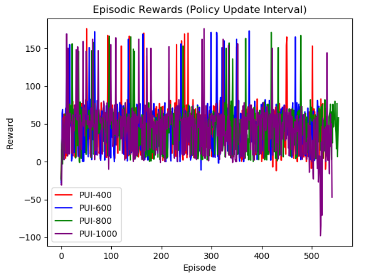 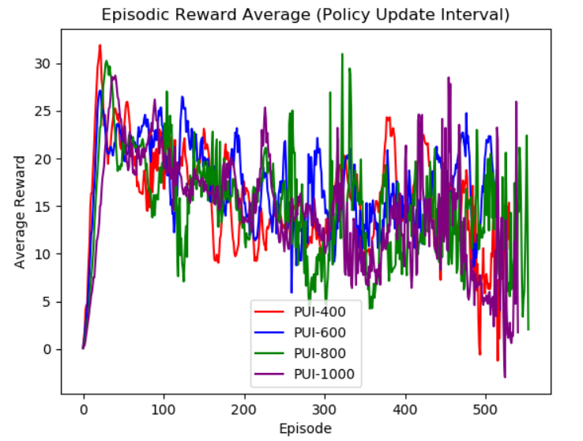
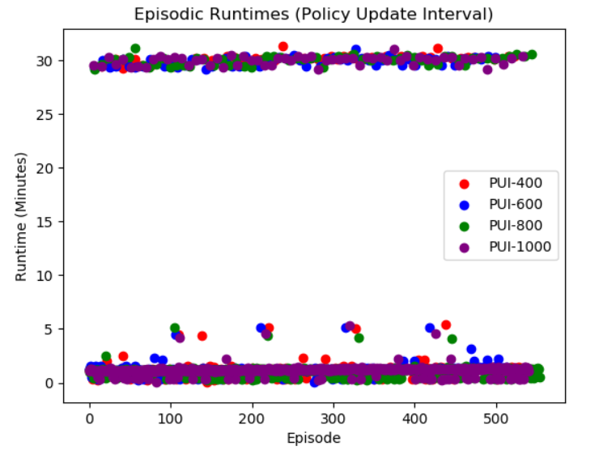

One method our group went with towards improving the baseline GAIL was to first change the `--policy-update-interval` value (PUI for brevity sake) hyperparameter to differ from the default provided. What the PUI does regarding the agent’s performance is based around the expert dataset used within the GAIL algorithm that our agent trains upon. Using Inverse Reinforcement Learning (IRL), our agent’s performance is analyzed using a cost function. This result is compared against various instances of the expert data set that are also analyzed with the IRL cost function, subsequently setting the maximal value obtained to be the new policy that our agent follows. This overall explains how our agent is training/learning within its respective environment. We decided to change these values from the default PUI to 400, 600, 800, and 1000, observing the results of these changes shown in the graphs above. As seen in the “Rewards” graph each change more or less appears to be performing to the same standard as before, however by taking a closer look at the values its shown that PUI-600 delivers the highest average over all rewards collected throughout all episodes with an average of 47.61 (standard deviation not calculated) compared to the rest; PUI-400: 47.03, PUI-800: 47.18, and PUI-1000: 44.84. While interesting, this unfortunately does not compare to the baseline’s best average result of 59.32 +- 30.6. This result in accordance follows that PUI-600 delivers the best policy average value as well visualized within the “policy_average_value” graph, with 17.20 average in comparison to the rest; PUI-400: 15.77, PUI-800: 14.97, and PUI-1000: 14.50. These policy average values show the uptake/rate an agent is improving upon within each episode and the rewards it gathers. Strangely enough, all these results seem to perform under-par with our original change made in the status report when we halved the PUI value, as that change not only gave us higher rewards, but also policy average values that showed the agent was learning at a faster rate than the baseline, something these PUI’s shown here are failing to achieve. Nonetheless, runtimes among the different PUI’s all seem to be performing at the same pace, with episodes ranging from the <5 minute mark up to 30 minutes for increasingly difficult environments. Yet, majority of these episodes reside within the <5 minute mark, showing that our agent is able to perform well enough within simple environments amidst the Minecraft world.

### Original Reward Weight (ORW)

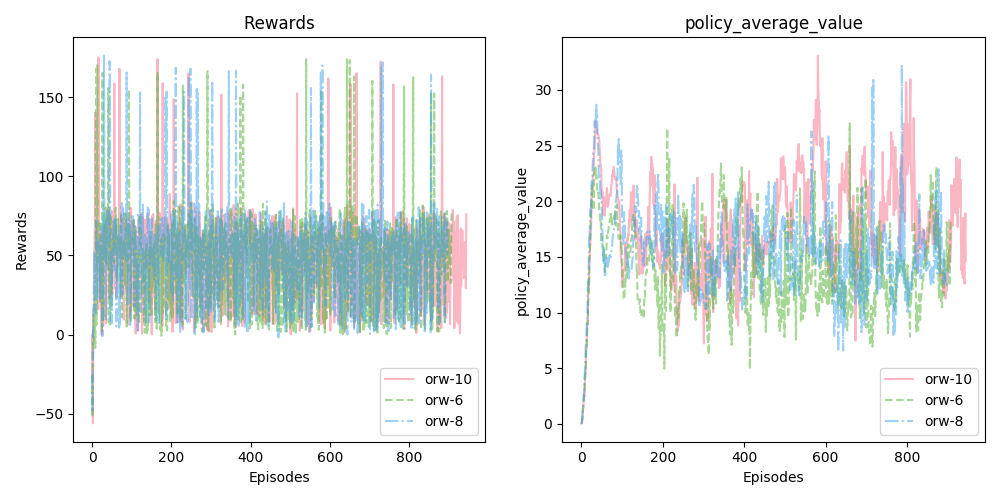

 

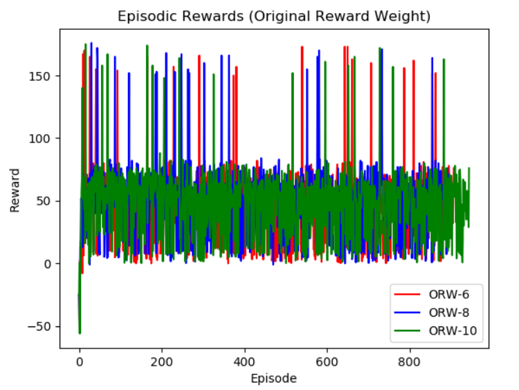 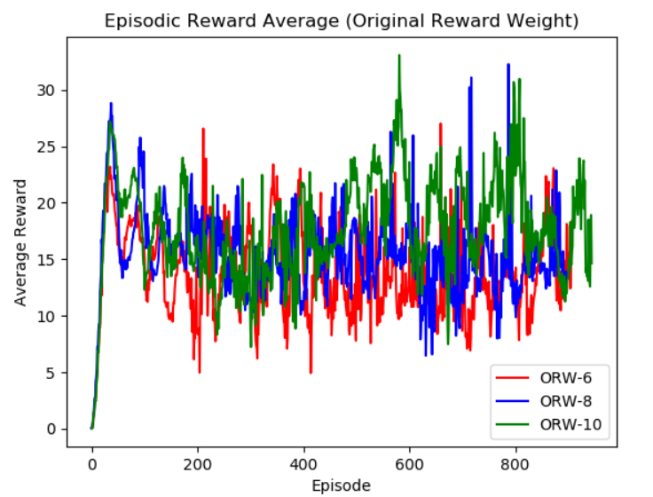
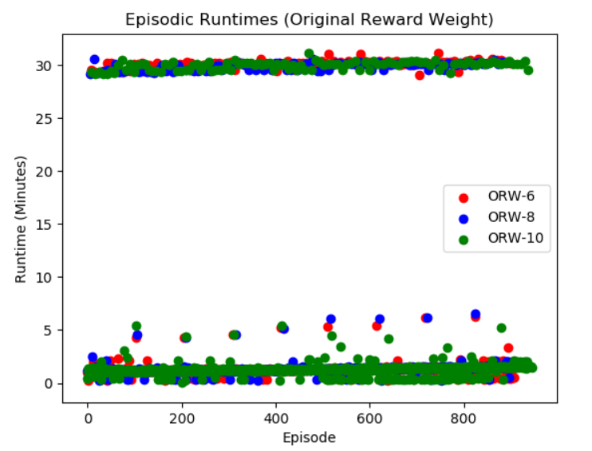

Moving on to our second method towards improving the baseline GAIL, we decided it best to alter the `--original-reward-weight` (ORW) hyperparameter to observe how this would affect the uptake/rate at which the agent learns including the reward values obtained. The ORW hyperparameter is essentially a constant used within the GAIL algorithm that works in tandem with the discriminator (more info on this in the next section) to calculate reward values for the actions our agent takes. By altering this value however, it should be noted that reward values will significantly differ from the original baseline GAIL, and that the goal in this situation is to improve primarily on the learning rate. This time around, we decided to change the ORW value to work with 6, 8, and 10 as the constants. Once again, as seen in the graph labeled “Rewards” each ORW change appears to be working similarly, with rewards varying around the 50 mark. Upon looking closer however, ORW-8 garners the highest average over all rewards within all episodes ran with the agent, achieving an average of 51.81 as compared to the rest; ORW-6: 46.63, and ORW-10: 48.10. Although, regarding the results gathered from average policy value as seen in the graph “policy_average_value”, ORW-10 had the better average at 17.72 compared to its counterparts; ORW-6: 13.76, and ORW-8: 15.34. As mentioned, we’re primarily looking at faster learning rates considering we’re directly affecting the reward values obtained, and such ORW-8 appears to be the leading contender in this regard. While it may not compare with the baseline’s 59.32 reward, it most certainly has the capabilities of teaching an agent the ability to learn faster. Unfortunately, in terms of runtime all the ORW hyperparameter changes don’t measure up to PUI hyperparameter changes. When observing both hyperparameters’ runtime graphs, ORW has a denser number of episodes that go up to the 30-minute mark, whereas PUI is a bit sparser in that area having most of its runtimes in the <5-minute mark.

### Discriminator Update Interval (DUI)

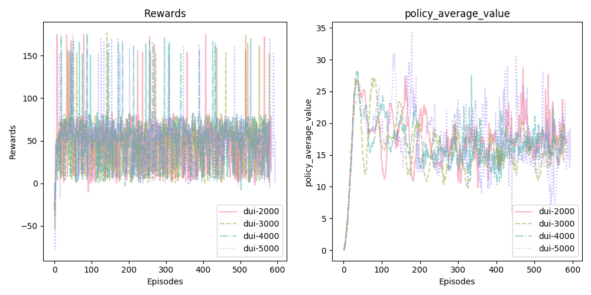

 

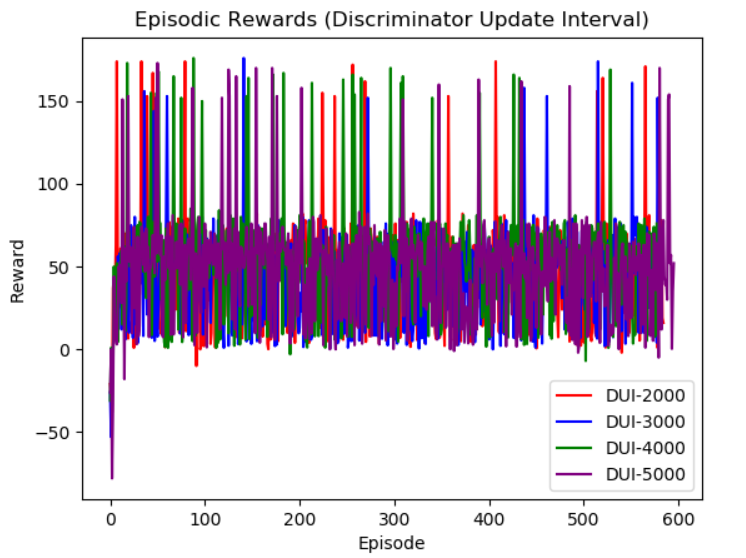 
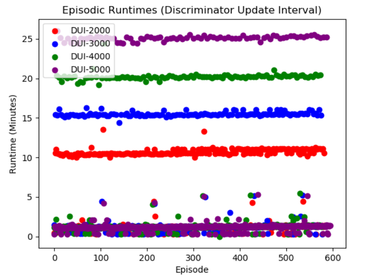

Finally, the last hyperparameter our group chose to alter was the `--discriminator-update-interval` (DUI). The discriminator for the GAIL algorithm functions as a normalizer. That is, it helps for normalization of observations and results generated by the algorithm with the intent to optimize the agent. Similar to the previously mentioned PUI, DUI executes an akin strategy utilizing a low cost function instead in ordinance with the data from the expert set that in turn updates its own parameters within the GAIL algorithm. This time we went with values 2000, 3000, 4000, and 5000 to fit the hyperparameter. To our surprise, the DUI changes had attained some of the best rewards than any of the other hyperparameter changes. Looking closer at the “Rewards,” DUI-4000 had the highest reward average over all episodes at 55.02 beating its partners; DUI-2000: 46.91, DUI-3000: 44.35, and DUI-5000: 48.68. This result surmounts our previously unbeatable improvement on halving the PUI back in our status report which received a 51.75 reward. Following this, we observed the average policy values from “policy_average_value” and saw DUI-5000 had the better of the values at an average policy of 17.46 with partners not trailing too far; DUI-2000: 17.41, DUI-3000: 16.12, DUI-4000: 16.67. Even more surprising was our observation of the runtimes for each change to the hyperparameter. No longer were we restrained to the <5-minute or 30-minute marks, instead there were varying effects. DUI-2000 averaged around the 10-minute mark, DUI-3000 at the 15-minute mark, DUI-4000 at the 20-minute mark, and DUI-5000 switching between <5-minute and 30-minute marks.

From these results gathered so far, the `--discriminator-update-interval` hyperparameter achieved some of the best results overall in comparison to other hyperparameters `--policy-update-interval` and `--original-reward-weight`. By changing DUI, the agent was able to attain higher rewards over all episodes and managed to stay within the same range of average policy values as the other hyperparameters, shying from the top spot that ORW won with 17.72 by a mere 0.26. We believe that by altering the DUI portion of the GAIL algorithm – maybe even with changes to ORW – there are even further methods of improvement to be made, but with the results we currently have DUI-4000 is our best performing improvement by far.

Apart from the key metrics such as Reward, Average Policy Value, and Runtimes, we also explored the following metrics across all the models with different hyperparameters. Although the following metrics are not our immediate focus, they do carry some information which can be used to assess the performance and robustness of the agents.

### Discriminator Average Loss

Fig.X Discriminator Average Loss

The general trend for all the agents we have tested are the same upward trend, which is not something we want in the ideal case. Ideally, the loss should decrease with more training and finally converge to a stable value. Although it is hard to figure out the reason for such unfavorable behavior, from the metrics of agents with different hyperparameters, we could gain some insights. Firstly, note that with smaller policy update interval, the discriminator tends to have lower loss and thus perform better. On the other hand, with smaller discriminator update interval, the discriminator tends to have higher loss. We think the smaller policy update interval makes the discriminator easier to overfit and have lower loss. Also, updating discriminator seems to put too more weights on less observation which could harm the performance of discriminator.

### Policy Average Value Loss
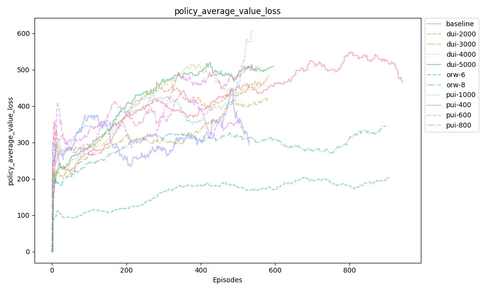

Fig.X Policy Average Value Loss

We observe the similar general trend for policy average value loss and discriminator average loss. However, one important difference is that the policy average value loss tends to have more oscillation than the discriminator one, making it hard to conclude if the policy loss is converging to a certain value or not. However, the general upward trend for policy average value loss does imply a good exploratory effort as the policy will change during exploration. Comparing to the other hyperparameters, the original reward weight seems to have a more significant impact on the policy average value loss. More specifically, the lower the weight is, the better the loss performance will be.

### Discriminator Average Entropy
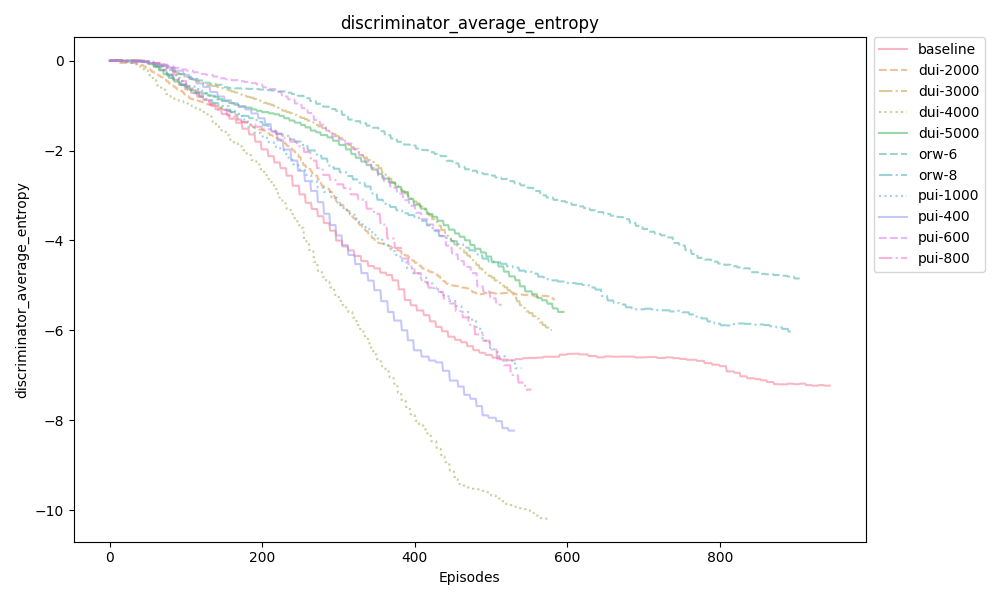

Fig.X Discriminator Average Entropy

Entropy is a representation of the randomness within an episode. An ideal graph would show the agent’s entropy decreasing over time, which is what we see in the graph here. We can observe that when DUI is reduced to 4000, the discriminators average entropy is at its lowest. We deduced that 4000 was the in the ideal range, and decreasing the value any further doesn’t allow enough time for the discriminator to make adequate updates each episode, which is why we see diminishing returns when we reduce the value. It should also be noted that while reductions in entropy are generally favored, some randomness can be beneficial in helping the agent make “guesses” that expedite the training process.

### Policy Average Entropy
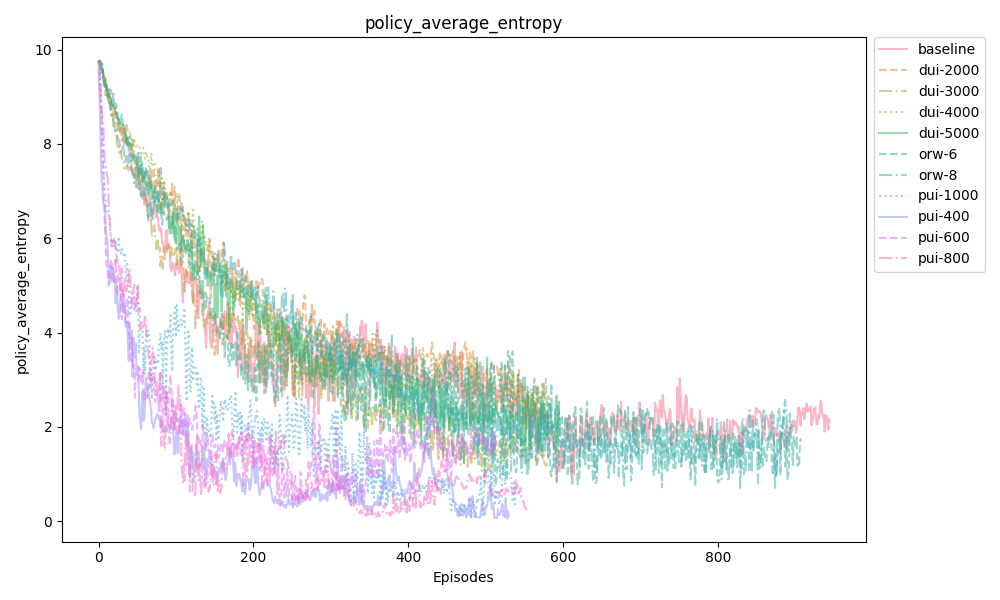

Fig.X Policy Average Entropy

Like the discriminator graph above, the general trend for all changes is downward on the policy graph as well. Also, the policy entropy graph follows a similar sporadic oscillation to the policy value loss graph, which again makes discerning if the values are converging somewhat challenging. What we can learn from this graph is that all of our changes do not dramatically affect the overall entropy loss over time as the agent trains through more episodes. This is significant because it lets us know that none of our various hyper-parameters will negatively impact the entropy of the agent.

## References

[GAIL Algorithm][1]

[Baselines][2]

[PPO vs TRPO][3]

[1]: https://arxiv.org/pdf/1606.03476.pdf)

[2]: https://github.com/minerllabs/baselines/tree/master/general/chainerrl#getting-started

[3]: https://towardsdatascience.com/introduction-to-various-reinforcement-learning-algorithms-part-ii-trpo-ppo-87f2c5919bb9
