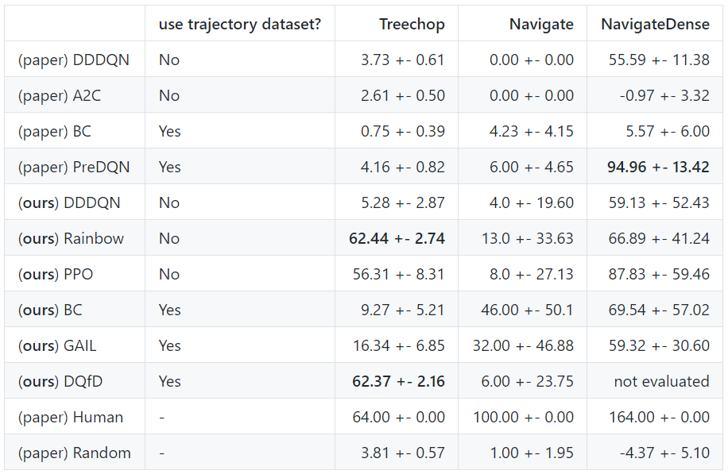
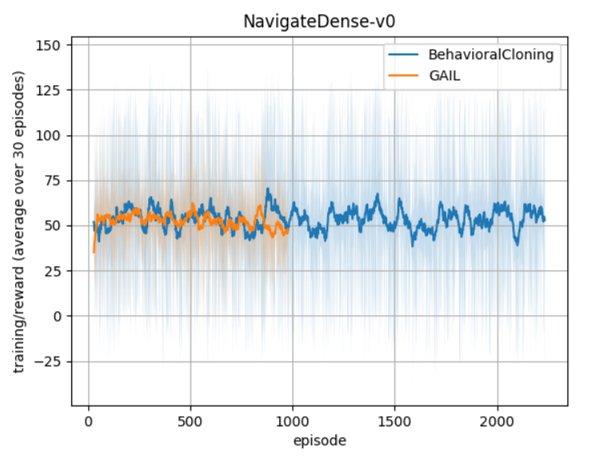
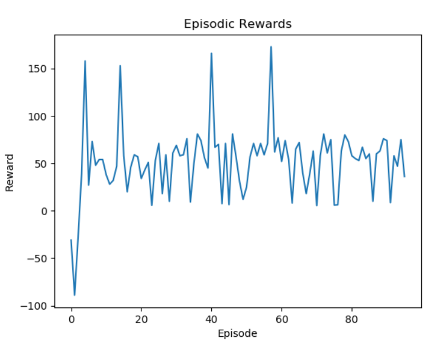
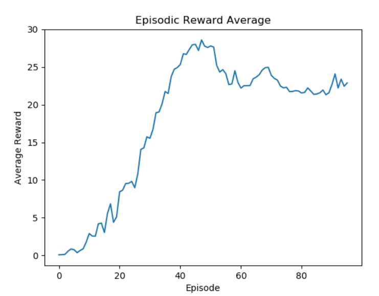
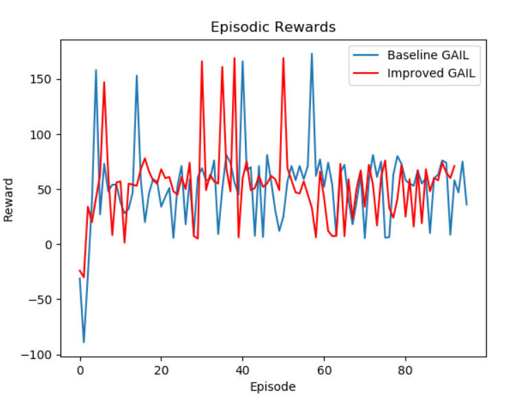
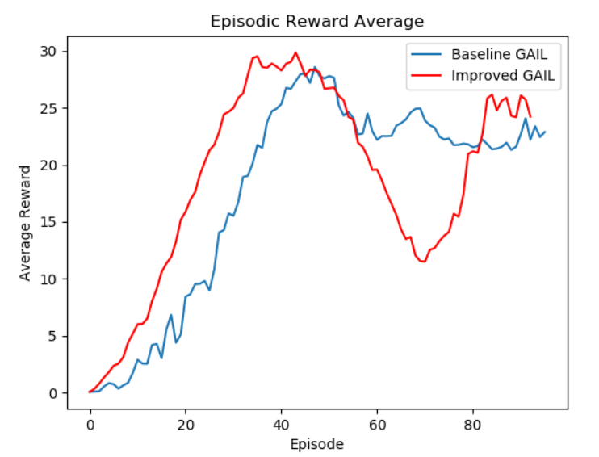

# Video Summary:
<iframe width="560" height="315" src="https://www.youtube.com/embed/J5Vo4RbCMuY" frameborder="0" allow="accelerometer; autoplay; encrypted-media; gyroscope; picture-in-picture" allowfullscreen></iframe>

# Project Summary:
The focus of this project is to train an agent that can successfully complete MineRLNavigateDense-vO from the MineRL competition. In this task, the agent must navigate a forest with the goal of locating a diamond block. The block can be positioned below or above the level of the agent. The agent distinguishes the goal block based on unique visual features compared to surrounding blocks. We chose navigate dense as opposed to navigate, because the dense environment provides a positive/negative reward to the agent every tick based on it's performance, while navigate is more sparse in it's rewarding. There are readily available implementations that we can use as a resource in solving this problem, and our goal for this task is to improve upon these implementations to create a superior agent either by increasing it's ability to reach the goal, or reducing the number of episodes necessary to converge. 

# Approach:
For our approach we began with an implementation of the generative adversarial imitation learning (GAIL) algorithm from a set of baseline functions. The GAIL algorithm is an application of an imitation learning approach called inverse reinforcement learning (IRL), a method used in training an agent to perform a task from the demonstrations of an expert without receiving any reinforcement signal. This is done through finding "a cost function under which the expert is uniquely optimal" on a trajectory dataset, but not telling the learner how to respond to that cost function. However, learning cost function could be computational intensive. To address this problem, GAIL directly learns a policy, bypassing any unnecessary IRL steps. GAIL employs both an IRL and RL in its solution. The optimal solution of the RL in the GAIL algorithm is equivalent to the solution from the IRL cost function. 

The IRL essentially uses a RL to find the lowest cost function out of a set of costs, assigns that cost to the expert policy, and assigns high costs to the rest. 

In order to improve the existing GAIL baseline algorithm, we focus on the hyperparameters it provides. Also, given our limited computing resource, improvements that could shorten the training time but also keep and even improve the performance become worth pursuing. So we decided to do experiments on the `policy-update-interval` by running two agents for 100 episodes with one has 2000 as the `policy-update-interval` and the other with 1000.

# Evaluation
Amongst other MineRL environments like “MineRLNavigate-vO” and “MineRLNavigateExtreme-vO”, MineRLNavigateDense-vO differs in that it delivers a reward towards the agent for every tick that passes within the current active episode. Based on the current location of the agent, the reward it receives varies in value depending on how far away the agent’s location is relative to the diamond block, the target goal within this environment. Upon reaching the diamond block, the agent is rewarded +100 for completing the task.

As stated previously in our approach, we’re determined to improve upon the already established GAIL baseline provided. While the GAIL baseline works great as is, we were interested in methods that would lead to greater reward outputs and shorter episode runtimes. Following this format, we’ll be comparing the results of the already provided GAIL algorithm gathered from numerous episodes against those gathered from our own implementation, with primary focus into reward and average policy value outputs to help in determining efficiency. The reason for choosing this evaluation approach is the fact that our implementation of GAIL follows policy update intervals that have been halved from the original baseline, which we believe could lead to faster learning.

  

Before jumping into our own evaluation, it should be known that the GAIL baseline has a provided overview of experimental results following the 100 best contiguous episodic runs the agent had performed in. The data for NavigateDense as seen in the table above shows the anticipated agent’s reward for each episode, accompanied with a standard deviation to account for variability within the environment. Additionally, there is a provided graphic to be seen how the baseline performs against other Reinforcement Learning agents like Behavioral Cloning.

  

Upon running the baseline GAIL algorithm and compiling all the reward outputs, it can be seen above in the graph labeled “Episodic Rewards” that the policy performs in a manner respective of the data shown before, with rewards ranging from 59.32 +- 30.60. Right beside it, the graph “Episodic Reward Average” shows us how the agent is performing in terms of learning with an uptake in anticipated average reward per episode.

  

In comparison to our own improvement of the GAIL algorithm, the agent undergoing our planned changes appears to be receiving on average a reward of 51.75 (standard deviation not calculated) that doesn’t quite match the average reward efficiency of the baseline GAIL algorithm, just being shy by 7.57. However, by comparing the two’s learning performance, the improved version appears to be learning at a faster rate than that of the baseline, with average reward uptake increasing at a faster rate than previously before. For episodes 53 to 81 our improved version’s learning performance isn’t quite to par with the baseline’s, but shortly afterwards begins to overtake it again. Through further testing, we hope that our improved version can demonstrate it’s a fast learner.

# Remaining Goals and Challenges
A huge limitation of the GAIL algorithm is that it is not model based, and thus requires far more interactions to achieve an effective agent. It is also quite computationally complex because it uses an RL in an inner loop, further increasing the time for the algorithm to run its course. Fortunately, there are many other baselines that we can examine. 

Our goal moving foward is to analyze and attempt to improve the Rainbow and PPO algorithms in the context of MineRLNavigateDense-vO, similarly to how we did so for GAIL. The main challenge of these algorithms is their lack of a trajectory data set to help with training the model. 

# Resources Used

[GAIL Algorithm](https://arxiv.org/pdf/1606.03476.pdf)

[Baselines](https://github.com/minerllabs/baselines/tree/master/general/chainerrl#getting-started).
